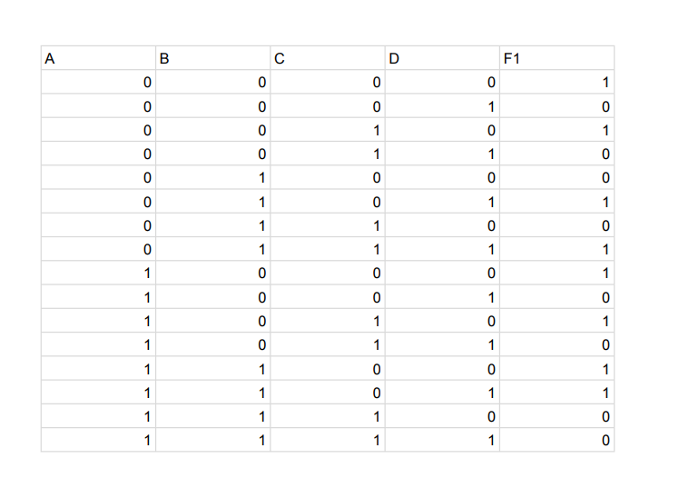

# Implementation-of-combinational-logic
 
## AIM:
To implement the given logic function verify its operation in Quartus using Verilog programming.
F1= A’B’C’D’+AC’D’+B’CD’+A’BCD+BC’D
## Equipments Required:
1. Hardware – PCs, Cyclone II , USB flasher
2. Software – Quartus prime
## Theory
Logic gates are electronic circuits which perform logical functions on one or more inputs to produce one output.
#### OR Gate:
The OR gate is a fundamental digital logic gate that operates on two binary inputs, producing an output of 1 if at least one input is 1. It symbolizes logical disjunction and is essential in building logical circuits and decision-making processes in computers and electronics.
#### AND Gate:
The AND gate is a fundamental digital logic gate with two inputs and one output. It produces a high output (1) only when both input signals are high (1). If any input is low (0), the output remains low. It's a building block for more complex logic circuits and is integral in digital computations.
#### NOT Gate:
The NOT gate is a fundamental digital logic gate. It has a single input and a single output. The output is the inverse of the input: if the input is high (1), the output is low (0), and vice versa. It's a basic building block in digital circuits, used for logic inversion.
## Procedure :

1.  Create a project with required entities.
2. Create a module along with respective file name.
3. Run the respective programs for the given boolean equations.
4. Run the module and get the respective RTL outputs.
5. Create university program(VWF) for getting timing diagram.
6. Give the respective inputs for timing diagram and obtain the results.

## Program:
## Program to implement the given logic function and to verify its operations in quartus using Verilog programming.
```py
Developed by: YUVARAJ.S
RegisterNumber: 22008589
module Ex2(a,b,c,d,f1);
input a,b,c,d;
output f1;
wire x1,x2,x3,x4,x5;
assign x1=(~a)&(~b)&(~c)&(~d);
assign x2=(a)&(~c)&(~d);
assign x3=(~b)&(c)&(~d);
assign x4=(~a)&(b)&(c)&(d);
assign x5=(b)&(~c)&(d);
assign f1=x1|x2|x3|x4|x5;
endmodule 
```
## RTL Diagram:

## Truth Table:

## Output Waveform:

## Result:
Thus the given logic functions are implemented using  and their operations are verified using Verilog programming.
